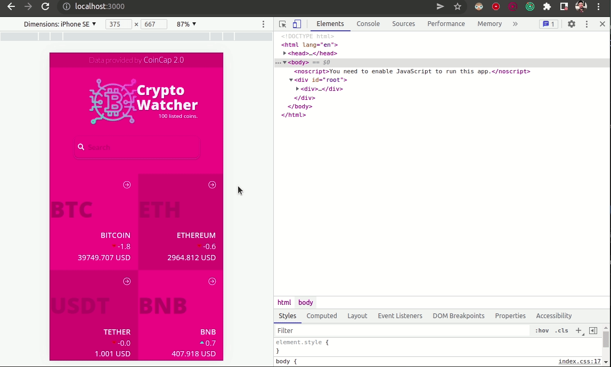

# Garrido CryptoWatch

> SPA that allows users to browse data from top-rated cryptocurrencies. 

## Built With

 
 

## Live Demo

[Live Demo](https://stupendous-piroshki-b9dbd8.netlify.app/)

## Documentation Video

[See here](https://www.loom.com/share/71312a4ed9df4f17a15c2391fa3d3db3)

## Getting Started

To get a local copy up and running follow these simple example steps.

### Prerequisites

Node.js

## Setup

### Install

You can run it on your local machine by cloning the project.

- Click on the green "Code" button
- Copy the link
- On your Terminal run `git clone $<LINK>` replacing `$<LINK>` with the link you just copied.
- cd to the folder where you cloned the repo
- Now you can run the commnads below as needed.

### Usage

### 1. `npm install`

Install all the dependencies needed for the project to work correctly.

### 2. `npm start`

Runs the app in the development mode.\
Open [http://localhost:3000](http://localhost:3000) to view it in your browser.

The page will reload when you make changes.\
You may also see any lint errors in the console.

### Run tests

### `npm test`

Launches the test runner in the interactive watch mode.

### Deployment

### `npm run build`

Builds the app for production to the `build` folder.\
It correctly bundles React in production mode and optimizes the build for the best performance.

The build is minified and the filenames include the hashes.\
This makes the app ready to be deployed!

## Authors

👤 Alef Garrido

- GitHub: [lef-garrido](https://github.com/alef-garrido)
- Twitter: [Alef_Garrido](https://twitter.com/Alef_Garrido)
- LinkedIn: [alef-g](https://www.linkedin.com/in/alef-g/)

## 🤝 Contributing

Contributions, issues, and feature requests are welcome!

Feel free to check the [issues page](https://github.com/alef-garrido/m3w1-react/issues).

## Show your support

Give a ⭐️ if you like this project!

## Acknowledgments 🤝

- This project was bootstrapped with [Create React App](https://github.com/facebook/create-react-app).
- Microverse's Curriculum project
- [CoinCap API 2.0](https://docs.coincap.io/)
- Bitcoin icon created by [photo3idea_studio](https://www.flaticon.com/free-icons/bitcoin)
- Thanks to all code reviewers

## 📝 License

This project is [MIT](./LICENSE.md) licensed.